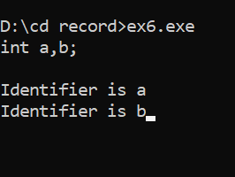

# Ex-4-LETTER-FOLLOWED-BY-ANY-NUMBER-OF-LETTERS-OR-DIGITS-USING-YACC-USING-YACC
RECOGNITION OF A VALID VARIABLE WHICH STARTS WITH A LETTER FOLLOWED BY ANY NUMBER OF LETTERS OR DIGITS USING YACC
# Aim:
To write a YACC program to recognize a valid variable which starts with a letter followed by any number of letters or digits.
# ALGORITHM
1.	Start the program.
2.	Write a program in the vi editor and save it with .l extension.
3.	In the lex program, write the translation rules for the keywords int, float and double and for the identifier.
4.	Write a program in the vi editor and save it with .y extension.
5.	Compile the lex program with lex compiler to produce output file as lex.yy.c. eg $ lex filename.l
6.	Compile the yacc program with YACC compiler to produce output file as y.tab.c. eg $ yacc –d arith_id.y
7.	Compile these with the C compiler as gcc lex.yy.c y.tab.c
8.	Enter a statement as input and the valid variables are identified as output.
# PROGRAM
```
%{
/* This LEX program returns the tokens for the Expression */
#include"y.tab.h"
%}
%%
"int" {return INT;}
"float" {return FLOAT;}
"double" {return DOUBLE;}
[a-zA-Z]*[0-9]* {printf("\nIdentifier is %s",yytext);
return ID;
}
. return yytext[0];
\n return 0;
%%
int yywrap()
{
return 1;
}
Program name:ex4.y
%{
#include<stdio.h>
/* This YACC program is for recognising the Expression*/
 %}
%token ID INT FLOAT DOUBLE
%%
D: T L
;
L: L,ID
| ID
;
T: INT
| FLOAT
| DOUBLE
;
%%
extern FILE*yyin;
main()
{
do
{
yyparse();
}while(!feof(yyin));
}
yyerror(char*s)
{
}
```
# Output



# Result
A YACC program to recognize a valid variable which starts with a letter followed by any number of letters or digits is executed successfully and the output is verified.
